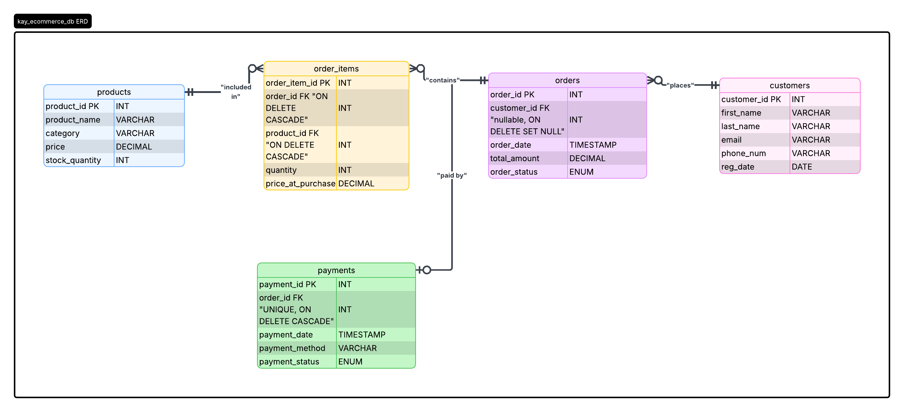

# Fashion E-Commerce Database System

**Course Module:** B103 Databases & Big Data  
**Institution:** Gisma University of Applied Sciences  
**Student Name:** Kazeem Olalekan Sola-Raji  
**Student ID:** GH1053278  

---

## 📌 Project Overview
This repository contains the complete implementation of a relational database system for a fashion-based E-commerce platform (`kay_ecommerce_db`). The database is engineered using **MariaDB** and is normalized to **Third Normal Form (3NF)** to completely eliminate data redundancy.

The system manages records for customer profiles, inventory metrics, order processing headers, transaction payments, and historical order line items.

### Core Features:
* **3NF:** Resolves the Many-to-Many ($M:N$) relational deadlock between `orders` and `products` through a dedicated associative bridge entity (`order_items`).
* **Financial Precision:** Uses explicit `DECIMAL(10,2)` parameters across all financial configurations to prevent floating-point rounding errors.
* **Pricing History:** Captures a `price_at_purchase` snapshot inside the line items to isolate historical business accounting from future live inventory price fluctuations.

---

## 🗺️ Database Schema (ER Diagram)
The database structure relies on five primary tables. Below is the relational mapping of the ecosystem:



---

## Deployment Instructions

Follow these steps to deploy and run the database system locally on your environment using MariaDB or MySQL:

### Prerequisites
* MariaDB Server or MySQL Server installed locally.
* A database client interface tool (e.g., DBeaver, MySQL Workbench, or Command Line CLI).

### Step-by-Step Execution
1. **Clone the Repository:**
   ```bash
   git clone [https://github.com/kay-learn-coding/my_SQL_project.git](https://github.com/kay-learn-coding/my_SQL_project.git)

2. **Execute the Database Script:**
   * Navigate into your local directory or copy the script contents.
   * Open your SQL editor tool (e.g., DBeaver or MySQL Workbench).
   * Open and execute the production script file named `kay_ecommerce_db.sql`. This single file initializes `kay_ecommerce_db`, builds all 5 normalized tables with strict constraints, and seeds them with retail sample data.

3. **Verify Runtime Functionality:**
   Execute the following relational query to confirm successful compilation and table joining across your entities:
   ```sql
   SELECT
       o.order_id,
       CONCAT(c.first_name, ' ', c.last_name) AS customer_name,
       p.product_name,
       oi.quantity,
       oi.price_at_purchase,
       (oi.quantity * oi.price_at_purchase) AS line_item_subtotal
   FROM orders o
   INNER JOIN customers c ON o.customer_id = c.customer_id
   INNER JOIN order_items oi ON o.order_id = oi.order_id
   INNER JOIN products p ON oi.product_id = p.product_id;
